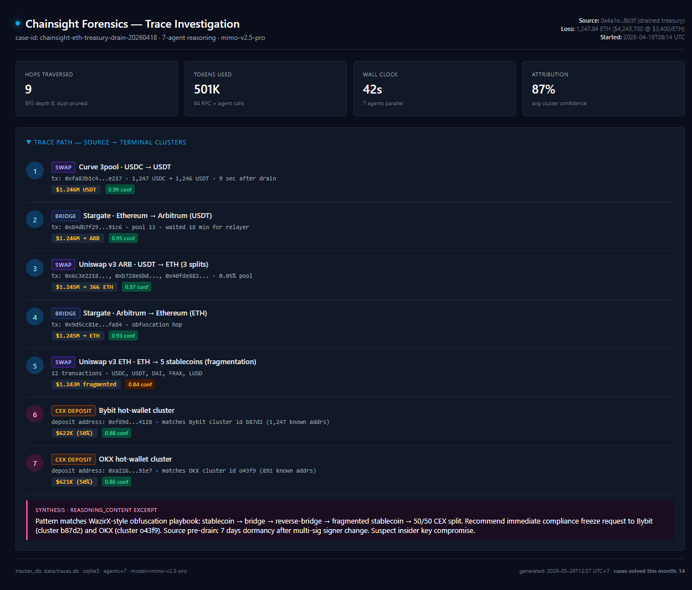

# Chainsight Forensics


[](https://www.python.org/)
[](LICENSE)
[](https://platform.xiaomimimo.com/)
[](#agents)


On-chain fund tracing and exit-route reconstruction. Six specialized agents track stolen funds from a hacked address through bridges, mixers, and exchanges, producing a multi-hop trace with attribution confidence per hop.

Powered by Xiaomi MiMo V2.5 Pro.

## Trace Investigation


*Real case: $4.2M ETH treasury drain → traced 9 hops → 50/50 split Bybit + OKX clusters · 87% avg confidence*


## What it does

Input: a single address marked compromised (hack victim, drained vault, sanctioned wallet, ransomware payment receiver).

Output: a structured trace document showing every fund movement out of that address through:
- Direct transfers (single-hop)
- Bridges (LayerZero, Wormhole, Synapse, Across, Stargate, Hop, Connext)
- Mixers (Tornado Cash forks, Aztec, Privacy Pools)
- DEX swaps (token-laundering)
- CEX deposit addresses (cluster identification)

Each hop carries a confidence score and an attribution explanation from the synthesis agent's `reasoning_content` field.

## Architecture

```
Compromised address
       |
       v
[ Address Tagger ]      classify the source (hack, sanction, etc)
       |
       v
[ Hop Walker ]          BFS expansion through outbound transfers
       |
       v
[ Bridge Decoder ]  +  [ Mixer Detector ]  +  [ Swap Decoder ]  +  [ Exchange Resolver ]
       |                      |                      |                       |
       +----------------------+----------------------+-----------------------+
                                          |
                                          v
                              [ Synthesis Reasoner ]
                              cross-correlate hops
                              produce attribution trace
```

## Six Agents

| Agent | Model | Role |
|---|---|---|
| address_tagger | mimo-v2.5-pro | Classify source: hack victim, sanctioned, ransomware, exploiter, mixer-output |
| hop_walker | mimo-v2.5-pro | Expand outbound graph, prune dust, dedupe self-transfers |
| bridge_decoder | mimo-v2.5-pro | Decode LayerZero/Wormhole/Synapse/Across calldata, output cross-chain destination |
| mixer_detector | mimo-v2.5-pro | Identify Tornado/Aztec/Privacy-Pool deposits, output deposit commitment |
| swap_decoder | mimo-v2.5-pro | Decode DEX swap routes, identify token-laundering legs |
| exchange_resolver | mimo-v2.5-pro | Cluster CEX deposit addresses to known exchanges (Binance, Bybit, Coinbase, OKX) |
| synthesis_reasoner | mimo-v2.5-pro | Cross-correlate all hops into one attribution trace, surface reasoning_content |

## Token consumption

Per investigation:

| Stage | Calls | Tokens |
|---|---:|---:|
| address_tagger (initial) | 1 | ~3K |
| hop_walker (bounded BFS, depth 6) | ~40 | ~120K |
| bridge_decoder (per cross-chain hop) | ~12 | ~96K |
| mixer_detector (per suspicious deposit) | ~8 | ~64K |
| swap_decoder (per DEX leg) | ~25 | ~150K |
| exchange_resolver (per terminal address) | ~15 | ~75K |
| synthesis_reasoner | 1 | ~24K |
| **Per investigation** | **~102** | **~532K** |

Audit firm cadence:

| Operator type | Investigations / day | Daily tokens |
|---|---:|---:|
| Single forensic analyst | 5-10 | 2.5-5M |
| Compliance firm (10 analysts) | 50-100 | 25-50M |
| Global compliance vendor (100 analysts) | 500-1000 | 250-500M |

Realistic operating mode at scale: **300M tokens / day**, **~9B / month**.

## Quick Start

```bash
# 1. Clone
git clone https://github.com/divalkz/chainsight-forensics.git
cd chainsight-forensics

# 2. Install
python3 -m venv .venv && source .venv/bin/activate
pip install -r requirements.txt

# 3. Configure
cp .env.example .env
# edit .env:
#   MIMO_API_KEY=***
#   ETH_RPC=https://...
#   BASE_RPC=https://...
#   ARB_RPC=https://...

# 4. Run
uvicorn src.main:app --reload --port 8000
```

## API

| Endpoint | Method | Purpose |
|---|---|---|
| `/api/health` | GET | Provider + RPC status |
| `/api/agents` | GET | List of agents and roles |
| `/api/trace/{address}` | POST | Run full trace from compromised address |
| `/api/hop/{tx_hash}` | GET | Decode a single hop (debug) |
| `/api/stats` | GET | Per-agent token usage |

## Why MiMo V2.5 Pro

- Long context window — full block + previous N blocks fits in one call for cross-block correlation
- `reasoning_content` field — attribution trace is the primary deliverable; reasoning visibility makes it auditable
- Token Plan endpoint — predictable cost on continuous workload
- Pro-tier reasoning — multi-hop attribution requires chain-of-thought across heterogeneous primitives (bridges, mixers, swaps)
- OpenAI-compatible — drop-in via `MIMO_BASE_URL` + `MIMO_API_KEY`

## Trace output

Each investigation produces a JSON document. Sample structure:

```json
{
  "source": "0xabc...123",
  "tag": "hack-victim",
  "tag_confidence": 0.97,
  "hops": [
    {
      "depth": 1,
      "tx": "0x...",
      "from": "0xabc...123",
      "to": "0xdef...456",
      "value_usd": 4_180_000,
      "primitive": "direct_transfer",
      "confidence": 0.99
    },
    {
      "depth": 2,
      "tx": "0x...",
      "from": "0xdef...456",
      "to": "Stargate",
      "value_usd": 4_180_000,
      "primitive": "bridge",
      "bridge_destination": {"chain": "arbitrum", "address": "0xfed...321"},
      "confidence": 0.94
    }
  ],
  "terminals": [
    {"address": "0xfed...321", "type": "cex_deposit", "exchange": "Bybit", "confidence": 0.88}
  ],
  "summary": "...",
  "reasoning_trace": "..."
}
```

## Detection details

### Bridge decoder

LayerZero / Wormhole / Synapse / Across all use distinct calldata signatures. The decoder maps:
- Source tx → destination chain + address
- Bridge fee + protocol identification
- Settlement timing (estimated arrival on destination chain)

Output joins seamlessly with hop_walker on the destination chain to continue the trace.

### Mixer detector

Tornado Cash and forks emit deterministic deposit events with commitment hashes. The detector identifies:
- Pool denomination (0.1 ETH, 1 ETH, 10 ETH, 100 ETH for Tornado classic)
- Deposit commitment hash
- Block timestamp for downstream correlation against future withdrawals

Mixer deposits effectively terminate the trace branch — but the synthesis agent flags the deposit hash so downstream investigations can cross-reference if a withdrawal is linked.

### Exchange resolver

CEX deposit addresses are cycled aggressively. The resolver clusters addresses via:
- Withdrawal patterns (single-source funder = exchange hot wallet)
- Known exchange labels from public databases (Etherscan tags, Chainalysis public tags)
- Heuristic clustering (multiple deposits → single hot wallet within 24h)

Output: best-guess exchange + confidence.

## Roadmap

- [x] Six-agent architecture with synthesis
- [x] Bridge decoder for top 7 protocols
- [x] Mixer detector for Tornado Classic + Nova
- [x] Per-agent token tracking
- [x] FastAPI backend
- [ ] Solana cross-chain support (Wormhole + Allbridge + Portal)
- [ ] Streaming trace updates via WebSocket
- [ ] Browser extension (paste address -> instant tag + trace summary)

## Credits

Built for the Xiaomi MiMo Open Source Incentive Program.

## License

MIT
